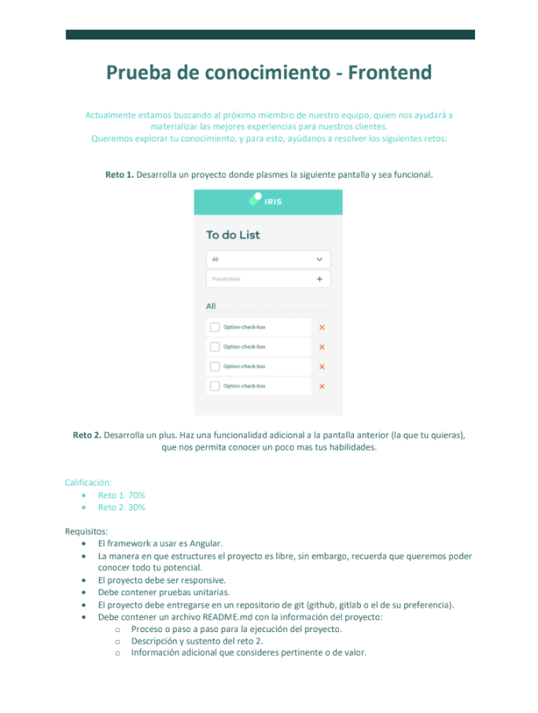
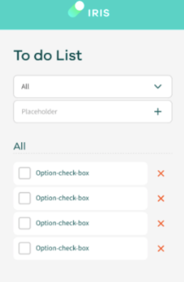
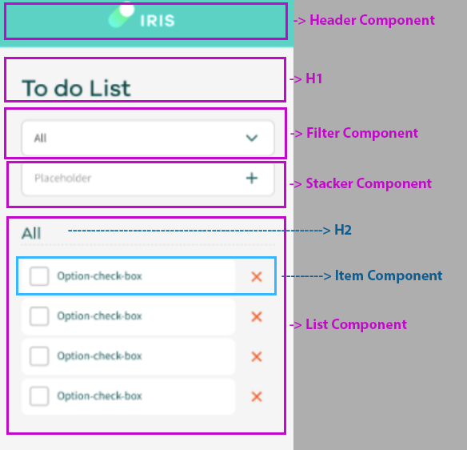

# Iris

This project was generated with [Angular CLI](https://github.com/angular/angular-cli) version 15.0.4.

This code challenge is a Todo List application built with Angular, with unit tests and responsive design.

## Code Challenge: Todo List

In this code challenge, you will be building a Todo List application using Angular. The application should allow users to create and manage a list of tasks, and should have the following features:

- Add new tasks
- Mark tasks as complete
- Delete tasks
- Filter tasks by status (all, complete, incomplete)

As an additional development, you should also implement the ability to edit task descriptions. This should allow users to change the description of an existing task.

The application should be fully unit tested, and should be responsive so that it can be used on desktop and mobile devices.

To complete this challenge, you should submit a GitHub repository containing the source code for the Todo List application, as well as any instructions necessary to build and run the application.

The challenge is described here:

And the window example is:

I have decided to structure my components in the following way: [header, filter, stacker, and list]. The list component will contain an h2 element and an item component, which will be populated with an array of todoItem elements.

## Test the site

You can test the site at the following URL:

[https://johanjaguardev.github.io/iris/](https://johanjaguardev.github.io/iris/)

## Development server

Run `ng serve` for a dev server. Navigate to `http://localhost:4200/`. The application will automatically reload if you change any of the source files.

## Code scaffolding

Run `ng generate component component-name` to generate a new component. You can also use `ng generate directive|pipe|service|class|guard|interface|enum|module`.

## Build

Run `ng build` to build the project. The build artifacts will be stored in the `dist/` directory.

## Running unit tests

Run `ng test` to execute the unit tests via [Karma](https://karma-runner.github.io).

## Running end-to-end tests

Run `ng e2e` to execute the end-to-end tests via a platform of your choice. To use this command, you need to first add a package that implements end-to-end testing capabilities.

## Further help

To get more help on the Angular CLI use `ng help` or go check out the [Angular CLI Overview and Command Reference](https://angular.io/cli) page.

## Continuous Delivery

This project is set up for continuous delivery using GitHub Actions. Whenever code changes are pushed to the `main` branch, the following steps are executed:

1. The code is checked out.
2. Dependencies are installed.
3. The Angular application is built.
4. The `root` folder is published to GitHub Pages.

The current status of the CD workflow can be viewed in the [Actions](https://github.com/johanjaguardev/iris/actions) tab.

## Branching Strategy

We use trunk-based development for this project, with the trunk branch being named `main`. To add a new feature, follow these steps:

1. Create a new feature branch from `main`.
2. Commit your changes to the feature branch and push them to the remote repository.
3. Open a pull request from the feature branch to `main`.
4. Use GitHub Actions to run automated tests on the code in the pull request.
5. If the tests pass, merge the pull request into `main`.

GitHub Actions and Pages are configured to automatically build and deploy updates to the `gh-pages` branch when changes are merged into `main`.

## Current Status

My Project is currently in local storage stage (v0.7.0) . Here is a list of the features that are currently implemented:

- First instalations and CD/CI integration
- Component division
- First TDD implementation
- First Stable CSS version only for mobile
- Stacker component action
- Delete action in item component
- Filter the item list
- Checked action
- CSS for desktop

## Future Steps

We are currently in the first stable version, and we will evaluate the implementation of potential features next.

## Potential Features

In addition to the features that we are currently working on, we also have a list of ideas for features that we may implement in the future. These features are not yet planned, but we are considering them for a future release:

- edit item descripction
- save status with local storage
- add notes

We welcome feedback and suggestions for new features! If you have an idea for a feature that you would like to see in My Project, please let us know by opening an issue or sending us an email.

## Changelog

### v0.1.0 (2023-01-05)

- Initial release
- Added Angular installation instructions
- Added CI/CD configuration using GitHub Actions and Github Pages

### v0.2.0 (2023-01-06)

- Mockups for components
- Creation of first components unit tests for [header, filter, list, stacker, item]
- Creation of first components [header, filter, list, stacker, item]

### v0.3.0 (2023-01-09)

- CSS for all components
- First version for event functions
- Fixing unit test after import material components

### v0.4.0 (2023-01-10)

- Creation of dataservice with addItem, removeItem, getItem and updateItem for use in all the application
- action stack elements to items array

### v0.5.0 (2023-01-10)

- Change the data-service implementing rxjs to get async data in list items
- fix remove item method in items
- changing unit test

### v0.6.0 (2023-01-10)

- Change the data-service to implement observables
- Implement filter action
- Change checkbox listener and update it in the service

### v0.7.0 (2023-01-10)

- Responsive CSS changes:
  - Added media queries for different screen sizes
- Bug fixes:
  - Fixed checkbox color
  - Fixed H2 with status in list items

### v1.0.0 (2023-01-10)

- Stable version responsive of todo without saving state
